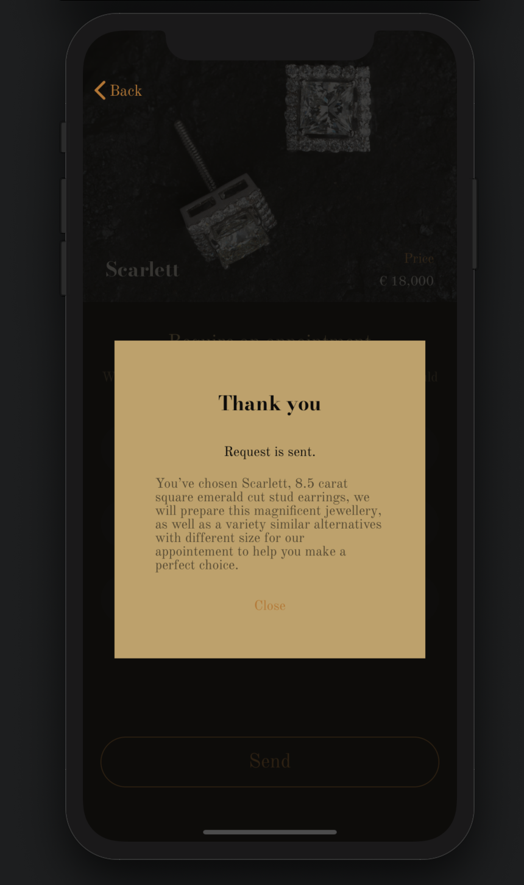

# Carat
> Application for the jeweller's shop.
>
> Written in SwiftUI.

 

### Fuctionality of the App
1. Demonstrates jewelleries made by company's team.
2. Provides additional information about items.
3. Allows to user to require an appointment.
4. Sends and gets data from the API.

 

### Screenshots

*Main View with Scroll Views: horizontal - for jewelleries, vartical - for description*

 

*Form for requesting an appointment by user*

 

*Custom Alert*

 

### Features 
- Codable conformance for @Published properties (CodingKeys, Decoder and Encoder instances)
- Custom views of Text Field and Alert 
- Keyboard responder to lift up the text fields and button if user is typing
 

### Communication
If you found a bug or want to discuss a new feature, feel free to [reach out](mailto:Valerika.Hello@gmail.com).

 

### Credits

I used in my project pictures made by photographer [say straight](https://www.pexels.com/@say-straight-1400349), who have published them on [Pexels](https://www.pexels.com) and allowed to download and use them. Thank you, your photos look stylish and costly 🤩

Amazing fonts that have chosen for the project is licensed under the SIL Open Font License. The licenses are encloded.

